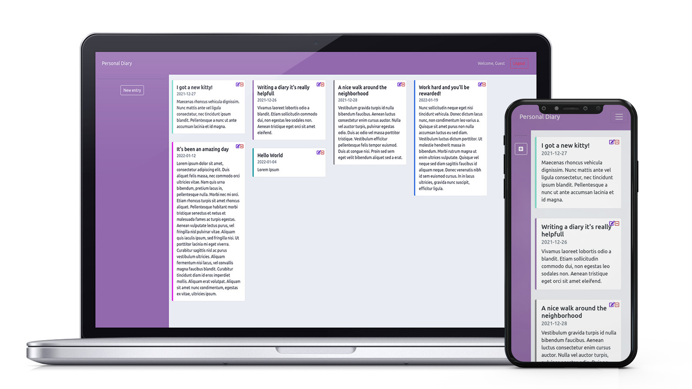

# Personal Diary

You can test the app by clicking the following link -> <a href="https://diary-dd0de.web.app/">Live Preview</a>

## Technologies

  <table>
<tr>
    <td align="center"height="108px" width="108px">
      
       <strong>JavaScript</strong>
    </td>
    <td align="center"height="108px" width="108px">
      
       <strong>React</strong>
    </td>
        <td align="center" height="108px" width="108px">
      
       <strong>HTML5</strong>
    </td>
        <td align="center"height="108px" width="108px">
      
       <strong>CSS3</strong>
    </td>
    </td>
        <td align="center"height="108px" width="108px">
      
       <strong>Bootstrap</strong>
    </td>
        <td align="center" height="108" width="108">
      
       <strong>Firebase</strong>
    </td>
</tr>
</table>

## Features

Create different entries with your experiences or your thoughts. Pick a color to organise them visually and give a unique touch to your virtual diary.